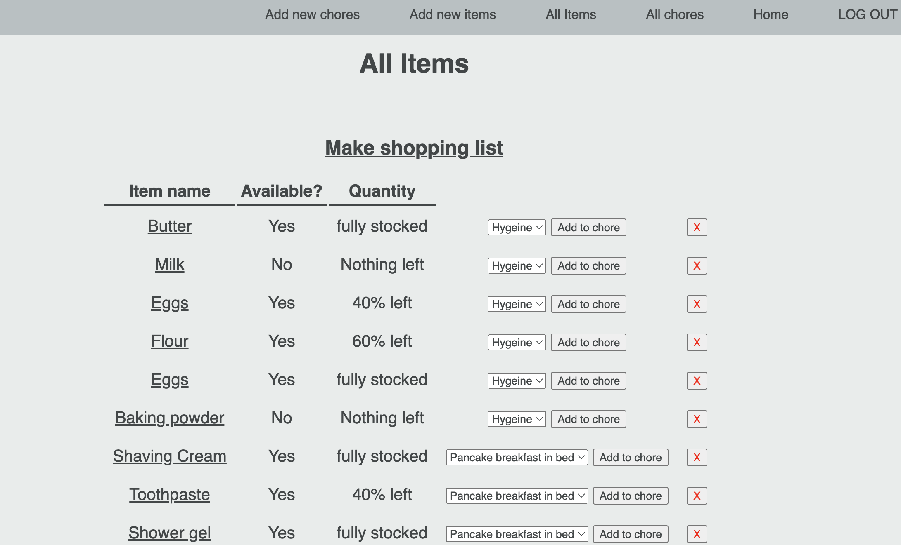

 # Shopping list + chores app 
 * This app lets you keep track of groceries and other household items and their states of depletion. 
 * It also allows you to add chores to which groceries/items can be linked. 
 * You can update an item as it is used to track its depletion - if the 

## Screenshots
### Start up screen

## Technologies Used 
* JavaScript
* HTML 
* CSS

## Getting Started 
[Deployed game](https://rrit5727.github.io/project1/)
* Click on a pair of cards and try find a match!
* Try find all the matching pairs before 10 incorrect guesses
* Try find edge cases e.g. click on the same card twice, click on the board background and click offscreen.

## Next steps
* Add animations and sounds
* Insert graphic element to show match instead of simple text
* create mystery pair of invisible cards for automatic win